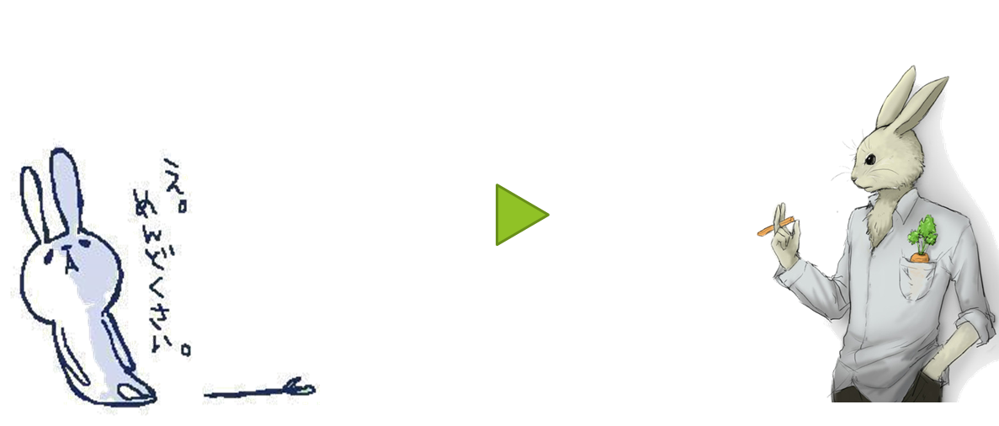
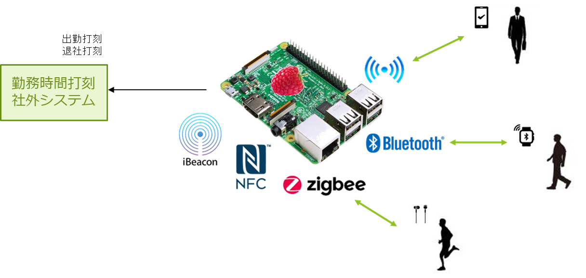
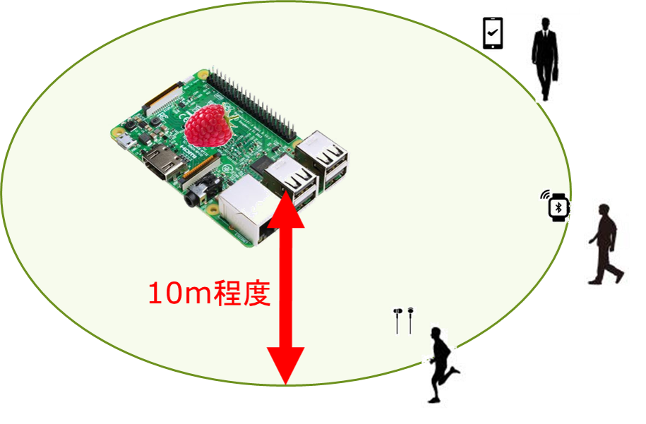
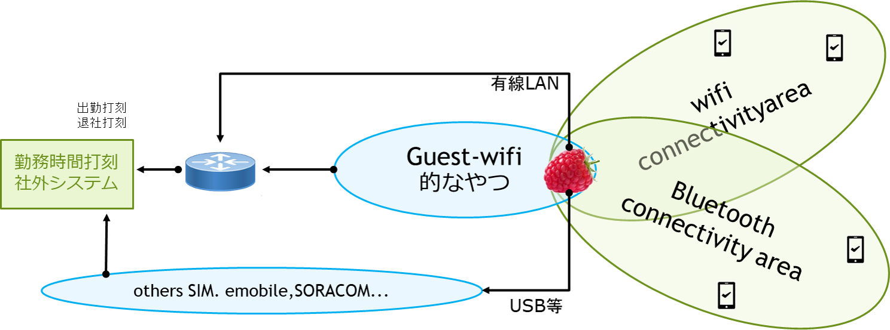
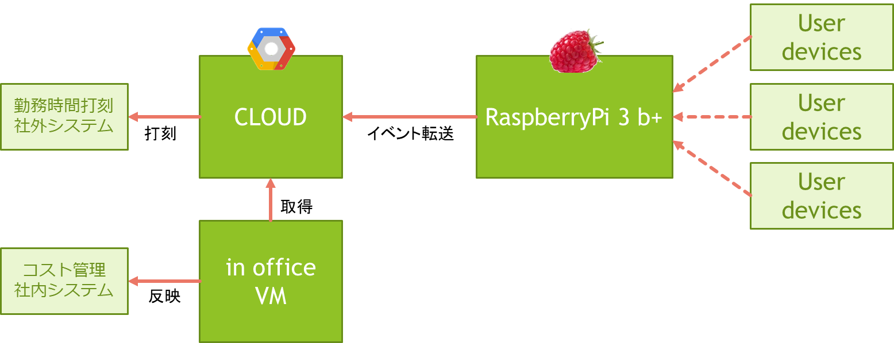
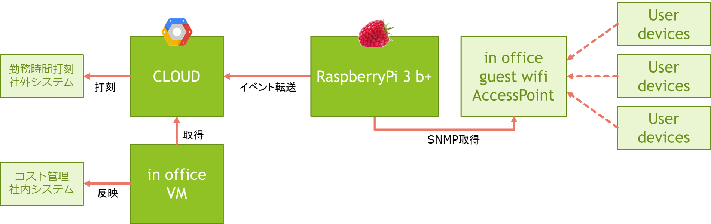
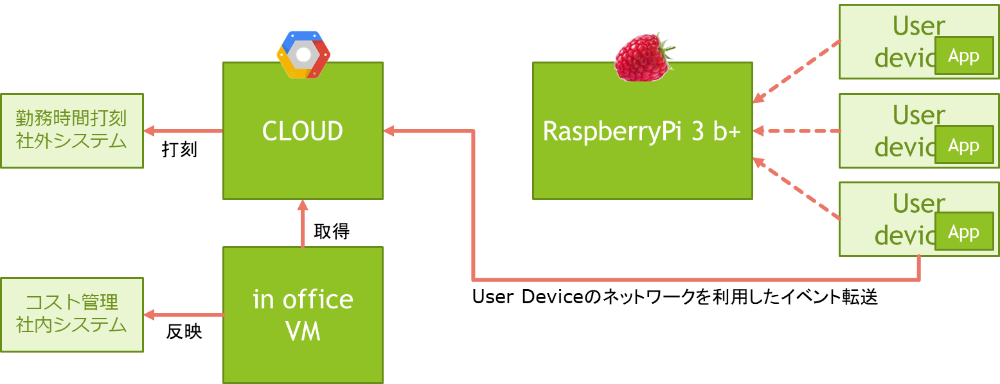
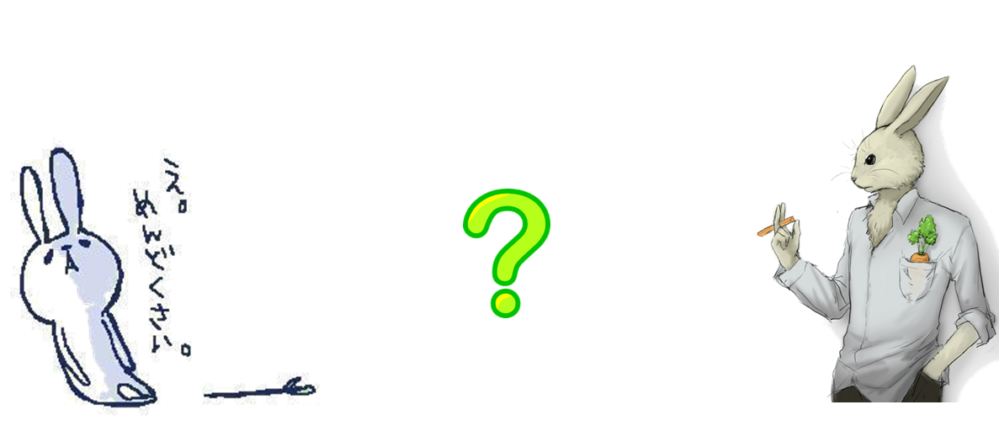

:tocdepth: 1

################################
Product Overview
################################

やっちまったなぁ～。
(Copyright `クールポコ。 <https://www.watanabepro.co.jp/mypage/4000005/>`_)

.. contents::
   :depth: 2
   :local:

our vision
=============================
めんどぐさがりやの出退勤を世界一スマートにする

[#f1]_ [#f2]_

|
|
|

motivation
=============================

* 解決すべき課題の優先度順
  
 * 社内勤務メンバの出勤退勤記録をしたい
 * 客先常駐メンバでも使えるようにしてあげたい
 * 勤務時間打刻社外システムとの連携を自動化したい
 * コスト管理社内システムとの連携を自動化したい

* 我らのやりたいことの優先度順
  
 * 遊びたい
 * とりあえず何かを作りたい

|
|
|
   
product function
=============================

* 人間の手を介在させない出退勤の実現
  
 * Wifi, Bluetooth,NFC,zigbee,iBeacon... で出退勤の自動打刻
 * 勤務時間打刻社外システムとの打刻連携
 * コスト管理社内システムとの連携
 * slack連携（BOSSが来た！的な）

|
|
|

product architecture 1
=============================

近距離通信インターフェースとの接続情報を使って出退勤を判断し勤務時間打刻社外システムに自動打刻する  

|
|
|

product architecture 2
=============================

10メートル程度の範囲で認識することが理想

|
|
|

product architecture 3
=============================

Wifi areaで接続できた端末はそのWifiを使って制限なくインターネットアクセスさせてあげたい(ip forwarding)

|
|
|

block diagram 1
=============================

|
|
|

block diagram 2
=============================

|
|
|

block diagram 3
=============================

|
|
|

AGAIN !!
=============================

**それは本当にスマートか？**

[#f1]_ [#f2]_

|
|
|

-------------------------

.. rubric:: 出典

.. [#f1] http://articleimage.nicoblomaga.jp/image/56/2014/8/7/873ccb4d808c2a16b227c4041b38787fee49d7f01405948150.jpg

.. [#f2] http://art22.photozou.jp/pub/172/336172/photo/62817110_624.v1554706871.jpg

