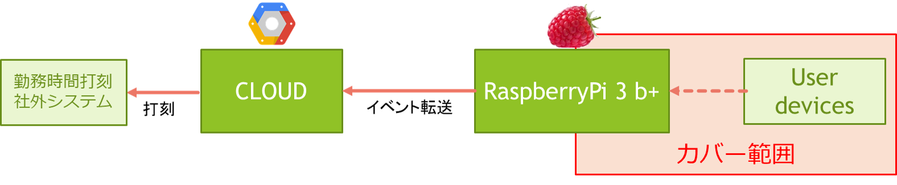

:tocdepth: 1

################################
Raspier
################################

.. contents::
   :depth: 2
   :local:

component scope
=============================

主にユーザデバイスとラズパイに関する責務を持つ。

|
|
|

component responsibility
=============================

* Raspi本体の環境設定、必要ソフトウェアをインストールする
* RaspiのWifi/Bluetoothアクセスポイント化する
* Wifi/Bluetoothの有効範囲、接続許容数、最長接続時間、iPhone/Androidの接続端末依存を評価する
* 電源(24365)の安全性、排熱の評価する
  
