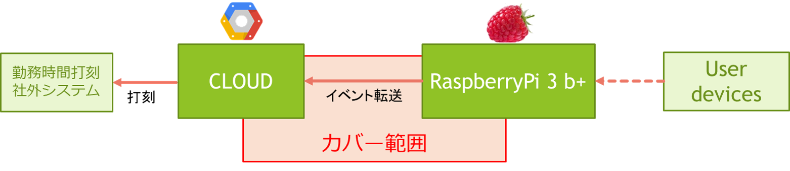

:tocdepth: 1

################################
EventHandler
################################

.. contents::
   :depth: 2
   :local:

component scope
=============================

主に、ラズパイで発生した接続イベントをクラウドに転送する責務を持つ。

|
|
|

component responsibility
=============================

* Raspiから得られる接続情報を解析しCLOUDにイベント転送する
* CLOUDにイベント転送されたイベントをCLOUD上のデータベースに格納する
* CLOUDデータベースのスキーマは我々が定義する  
