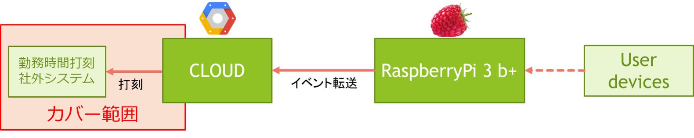

:tocdepth: 1

################################
Service Controller
################################

.. contents::
   :depth: 2
   :local:

component scope
=============================

主に、出退勤パンチサービスとのインターフェースを責務とする。

|
|
|

component responsibility
=============================

* CLOUD上のデータベースに格納された情報を解析し、勤務時間打刻社外システムに打刻する
* 出勤・退勤のルールを定義し、ルールに従って勤務時間打刻社外システムのAPIを叩く
* ユーザ情報のスキーマを定義する
