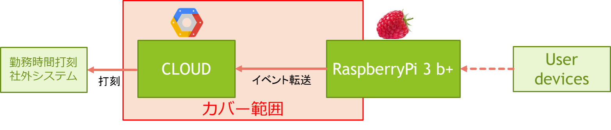

:tocdepth: 1

################################
Clouder
################################

.. contents::
   :depth: 2
   :local:

component scope
=============================

主にクラウド系インフラ構成と種々なパイプラインを責務とする。

|
|
|

component responsibility
=============================

* センサデータ受信蓄積基盤（ph1 IoT Core、Pub/Sub、Dataflow、Bigtable or Datastore or SQL）
* センサデータ定期処理基盤（ph1 VM or Scheduler・Functions・BigQuery、勤務時間打刻社外システム打刻）
* DevOpsパイプライン（ph1 Cloud Build/Golang Cloud Storage）
* RasPi監視（ph1 Ondemand - IoT Core、 ph1.5 Monitoring - Scheluder・IoT Core・Cloud Monitoring）
* reST Build/Deploy（ph1-1.5 Github・Cloud Build/Sphinx・Cloud Storage）
* RasPiソフトウェア配信（ph1.5 依存ライブラリ更新＋APP配信＋制御ファイル配信＋定時アップデート）

|
|
|
  
cloud architecture
=============================

.. image:: ../_static/images/02_04_002.svg
 :scale: 60

